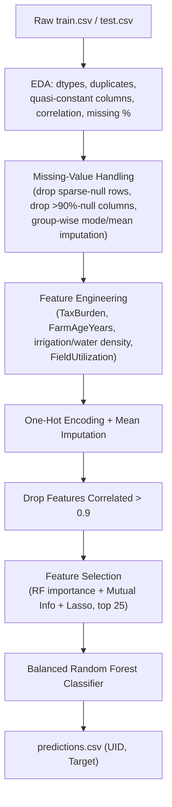

# Machine Learing: Kaggle Estimating Agrarian Land Efficiency

[](https://www.kaggle.com/competitions/vnb-foml-2024-hackathon)
[](https://www.python.org/downloads/)
[](https://imbalanced-learn.org/)
[]()

This repository contains the data pipeline, feature engineering, and classifier developed for the [**VNB FoML 2024 Hackathon**](https://www.kaggle.com/competitions/vnb-foml-2024-hackathon) hosted on Kaggle.

---

## Competition & Dataset Link

* **Official Kaggle Competition Page**: [https://www.kaggle.com/competitions/vnb-foml-2024-hackathon](https://www.kaggle.com/competitions/vnb-foml-2024-hackathon)
* **Leaderboard & Submissions**: Accessible directly via the above competition URL.

---

## Problem Statement & Task

The task is to predict whether an agricultural field is being used **efficiently** — not simply how much it yields, but whether it is achieving its potential given its resources, size, and other qualities. A field labelled "low performing," for instance, may still produce a decent yield, but fails to maximize its potential due to inefficiencies (e.g. distance from market). Every field is classified into one of three categories:

* **High performing**
* **Moderately performing** (encoded as `medium` in the data)
* **Low performing**

Submissions are evaluated on the **macro F1-score** over a held-out test set of 15,921 unlabelled fields — this weights all three classes equally, rather than rewarding accuracy on the majority class alone.

### Dataset Specifications

Each field is described by roughly 55 attributes:

* **Land & Cultivation**: field size, total/cultivated area, land usage type, number of farming zones.
* **Irrigation & Water**: irrigation system type/count, water access points, reservoirs, natural lake presence.
* **Soil & Harvest**: soil fertility type, harvest processing type, harvest/underground storage capacity.
* **Tax & Valuation**: tax-assessed value, land value, agrarian value, valuation year, overdue status.
* **Identifiers & Location**: `UID`, district/town/region IDs, latitude/longitude.
* **Missing Data**: many columns carry substantial missingness — several exceed 90% missing values.

| Split | Samples | Status |
| :--- | :---: | :--- |
| **Train** | 112,569 | Labelled (`Target`: low / medium / high) |
| **Test** | 15,921 | Unlabelled |

> [!IMPORTANT]
> **Class Imbalance (discovered during EDA)**:
> The `Target` classes are not evenly distributed — roughly 60% of training fields fall into **medium**, with **low** and **high** splitting the remainder evenly. Since the competition scores submissions on macro F1 (which treats all three classes equally regardless of frequency), optimizing for raw accuracy alone would be misleading — this is why the final model is a *Balanced* Random Forest rather than a plain one.

---

## Dataset Access

The dataset is provided by the Kaggle competition and is not bundled in this repository (`train.csv` is ~28 MB, `test.csv` is ~4 MB).

### Method 1: Kaggle CLI
```bash
kaggle competitions download -c vnb-foml-2024-hackathon -p ./data
unzip ./data/*.zip -d ./data
```

### Method 2: Manual Web Download
Navigate to the [competition's Data tab](https://www.kaggle.com/competitions/vnb-foml-2024-hackathon/data), click **Download All**, and extract the archive so the files match:
```
data/
├── train.csv
└── test.csv
```

---

## Methodology



### 1. Missing-Value Handling
Rows are dropped for columns with under 2% missingness; columns with over 90% missingness are dropped outright. The remaining gaps in a handful of important columns (`HarvestProcessingType`, `CultivatedAreaSqft1`, `FieldSizeSqft`, `SoilFertilityType`) are filled using group-wise mode/mean statistics (grouped by related location columns), with an overall mode/mean fallback — all derived from the training set only and reused on test.

### 2. Feature Engineering
Derived features aimed at capturing domain-relevant ratios rather than raw magnitudes:

| Feature | Formula |
| :--- | :--- |
| `TaxBurden` | `TotalTaxAssessed / (TotalValue + 1)` |
| `AgrarianValueProportion` | `TaxAgrarianValue / (TotalValue + 1)` |
| `FarmAgeYears` | `max(ValuationYear) - FieldEstablishedYear` |
| `TotalIrrigationSystems` | `MainIrrigationSystemCount + 0.5 * PartialIrrigationSystemCount` |
| `IrrigationAreaDensity` | `TotalIrrigationSystems / TotalCultivatedAreaSqft` |
| `WaterResources` | `WaterAccessPoints + WaterReservoirCount`, boosted 1.5x if `NaturalLakePresence` |
| `WaterAreaDensity` | `WaterResources / TotalCultivatedAreaSqft` |
| `FieldUtilization` | `(SoilFertilityType + WaterResources + FarmVehicleCount + TotalIrrigationSystems + StorageAndFacilityCount) / FieldSizeSqft` |

### 3. Encoding, Redundancy Removal & Feature Selection
Remaining categorical columns (`LandUsageType`, `HarvestProcessingType`, `TypeOfIrrigationSystem`, `SoilFertilityType`) are one-hot encoded and any leftover gaps mean-imputed. Feature pairs correlated above 0.9 are pruned (keeping the one with fewer missing values). The surviving features are then scored by three independent methods — Random Forest importance, mutual information, and Lasso coefficients — and the top 25 by combined score are kept for training.

### 4. Model — Balanced Random Forest
```python
BalancedRandomForestClassifier(
    n_estimators=100,
    sampling_strategy='all',   # resample every class, not just the minority ones
    replacement=True,          # sample with replacement
    bootstrap=False,
    random_state=42
)
```
Unlike a plain `RandomForestClassifier`, it internally resamples each tree's training data so all three classes are equally represented — important given the class imbalance noted above.

---

## Hyperparameter Summary

| Parameter | Value | Parameter | Value |
| :--- | :--- | :--- | :--- |
| **Row-drop threshold** (missing) | < 2% nulls | **Column-drop threshold** (missing) | > 90% nulls |
| **Correlation-prune threshold** | 0.9 | **Selected feature count** | 25 |
| **`n_estimators`** | 100 | **`sampling_strategy`** | `'all'` |
| **`replacement`** | `True` | **`bootstrap`** | `False` |
| **Lasso `alpha`** | 0.01 | **Random Seed** | 42 |

---

## Repository Structure

```
Agricultural-Field-Performance-Classification/
├── Report.pdf                                     # Project report
├── requirements.txt                               # Dependencies
├── code/
│   ├── balanced_random_forest_classifier.py       # CLI pipeline script
│   └── balanced_random_forest_classifier.ipynb    # Annotated, step-by-step notebook
└── data/
    ├── train.csv
    ├── test.csv
    └── predictions.csv                            # Generated submission file
```

---

## Execution Guide

### Installation
```bash
pip install -r requirements.txt
```

### Option 1: CLI Script
```bash
cd code
python balanced_random_forest_classifier.py \
  --train-file ../data/train.csv \
  --test-file ../data/test.csv \
  --predictions-file ../data/predictions.csv
```
> **Note**: `--train-file` is accepted but not wired up — the script always reads `../data/train.csv` (run it from `code/` as shown above). Only `--test-file` and `--predictions-file` are actually used.

### Option 2: Notebook
Open `code/balanced_random_forest_classifier.ipynb` and run all cells for the same pipeline with EDA plots and intermediate outputs visible at each stage.

---

## Challenges & Technical Solutions

1. **Extensive Missing Data**: Several columns are missing in over 90% of rows. These were dropped outright rather than imputed, since imputing that much of a column would mostly be fabricating values, not recovering signal.
2. **Class Imbalance**: `medium` accounts for roughly 60% of the training labels. A `BalancedRandomForestClassifier` was used instead of a plain Random Forest so each tree sees a resampled, class-balanced training set.
3. **Train/Test Consistency**: All imputation statistics (modes, means) and one-hot encoding columns are computed from the training set only and then reused on the test set, avoiding target leakage and keeping the two sets aligned.
4. **Redundant Features After Encoding**: One-hot encoding introduces near-duplicate, highly correlated columns; a correlation-threshold pruning step (0.9) removes the redundant half of each pair before feature selection.

---

## Reference

* [VNB FoML 2024 Hackathon — Kaggle](https://www.kaggle.com/competitions/vnb-foml-2024-hackathon)
* [imbalanced-learn: BalancedRandomForestClassifier](https://imbalanced-learn.org/stable/references/generated/imblearn.ensemble.BalancedRandomForestClassifier.html)
